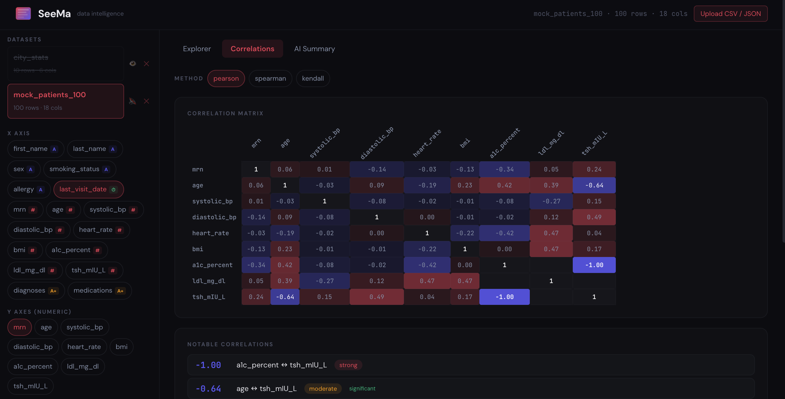

# SeeMa — Data Intelligence Dashboard

**SeeMa** (سیما, "horizon" in Dari/Farsi) is a full-stack data visualization and intelligence tool. Upload any CSV or JSON dataset and SeeMa will automatically profile it, detect correlations, suggest visualizations, and generate AI-powered narrative analysis that actually understands your data.



## What It Does

SeeMa is built around three core capabilities:

**Explorer.** Upload a dataset and SeeMa immediately classifies every column (numeric, categorical, datetime, ID, high-cardinality), computes distributions, detects outliers, and suggests the most meaningful visualizations. You pick X, Y, and Z axes from toggleable selectors, choose a chart type (bar, line, area, scatter, bubble), and customize axis labels. Column profile cards show mean, standard deviation, range, distribution type, and outlier counts at a glance.

**Correlations.** A full correlation matrix with Pearson, Spearman, and Kendall methods. Click any cell to drill into a pairwise analysis with scatter plots, regression lines, R² values, and p-values. Notable correlations are ranked and flagged by strength and significance.

**AI Summary.** This is not a shape-of-the-data summary. SeeMa sends Claude the full picture: categorical distributions with percentages, numeric statistics with missing data patterns, top diagnoses and medications, sample rows for context. The AI then produces a domain-aware narrative: interpreting BMI values against clinical thresholds, flagging that only 13% of patients have A1C results (suggesting labs were ordered selectively), identifying population-level hypertension trends. It works for any domain: financial data, sales pipelines, city demographics, clinical datasets.

## Quick Start

### Option 1: Start Script

If you have `start.sh` in the project root:

```bash
chmod +x start.sh
./start.sh
```

This launches backend on `:8000` and frontend on `:5174`.

### Option 2: Manual

**Backend** (Python 3.11+):

```bash
cd backend
python -m venv venv
source venv/bin/activate
pip install -r requirements.txt
uvicorn main:app --reload --port 8000
```

**Frontend** (Node 18+):

```bash
cd frontend
npm install
npm run dev -- --port 5174
```

Open [http://localhost:5174](http://localhost:5174).

## Project Structure

```
seema/
├── backend/
│   ├── main.py            # FastAPI server, endpoints, column classification, AI summary
│   ├── analyzer.py        # Statistical engine (profiling, correlations, distributions)
│   └── requirements.txt
├── frontend/
│   ├── src/
│   │   └── App.jsx        # Entire dashboard (single-file React app)
│   ├── index.html
│   ├── package.json
│   └── vite.config.js
├── docs/
│   └── screenshot.png
├── start.sh               # One-command launcher
└── README.md
```

## Configuration

Create `backend/.env` for AI-powered summaries:

```
ANTHROPIC_API_KEY=sk-ant-...
```

Without this key, SeeMa falls back to a statistical summary engine that still provides categorical breakdowns, numeric highlights, correlation flags, and missing data analysis. With the key, you get full narrative intelligence.

## Features

| Feature | Details |
|---------|---------|
| Auto-profiling | Column type detection, distribution analysis, outlier flagging |
| Smart suggestions | Recommends chart types based on data structure and correlations |
| Toggleable axes | Click to select/deselect X, Y, Z axes. No forced selections |
| Bubble charts | Map a third numeric dimension to dot size |
| Custom axis labels | Editable labels for X, Y, Z axes |
| Correlation matrix | Pearson, Spearman, Kendall with clickable drill-down |
| Pairwise analysis | Scatter plot, regression, R², p-values |
| AI narrative | Domain-aware analysis via Claude API |
| Dataset management | Upload, mute, delete. Mute state persists across refreshes |
| NaN-safe | Handles missing data, sparse columns, and mixed types gracefully |
| Sample datasets | Ships with tech_revenue, monthly_sales, city_stats |

## Tech Stack

| Layer | Technology |
|-------|-----------|
| Frontend | React 18, Recharts, Vite |
| Backend | FastAPI, Uvicorn |
| Analysis | pandas, scipy, numpy |
| AI | Anthropic Claude API (Sonnet) |
| Styling | Inline CSS, dark theme, JetBrains Mono |

## API Endpoints

| Method | Endpoint | Description |
|--------|----------|-------------|
| GET | `/datasets` | List all loaded datasets |
| POST | `/upload` | Upload CSV/JSON/TSV file |
| DELETE | `/datasets/{name}` | Remove a dataset |
| GET | `/analyze/{name}` | Full analysis (profile, classify, suggest, data) |
| GET | `/correlations/{name}` | Correlation matrix with configurable method |
| GET | `/pairwise/{name}` | Detailed pairwise statistics for two columns |
| GET | `/summary/{name}` | AI-powered or statistical summary |

## License

Copyright © 2025 Wali. All rights reserved.

This software is proprietary. You may not copy, modify, distribute, or create derivative works from this software without explicit written permission from the author. For licensing inquiries, contact waliodysseus(AT)gmail.com.